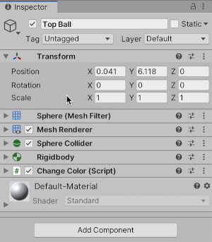

**The University of Melbourne**
# COMP30019 – Graphics and Interaction

## Workshop 1

# Introduction:

In this lab you will be introduced to Unity, a powerful games and simulation engine which facilitates the construction of rich interactive scenes.

Start by opening `Scenes > Main`.

* **Main.unity** - This is the main file where we are going to recreate the behaviors that you see in the scene.

In the center you can see a `Play` button. Click on it and the simulation will start. You should be able to see the same action as the gif at the top of this README.
Make sure to understand the diference between the `Scene tab` and the `Game tab`. While playing you are automatically switched to the 'Game' tab and while editing you are switched to the 'Scene' tab. Although the switch is automatic, it is possible to manually switch between these whether you are playing or editing.

Explore this scene, in the `Hierarchy` (on the left) you can see all the `GameObjects` that are part of the scene:

* **Main Camera** - Viewpoint of the player, moving this GameObject position makes the player move.
* **Directional Ligth** - The Sun in the scene.
* **Top Ball and Bottom Ball** - Balls that include physics (`RigidBody`) and a script to change their color on Collision.
* **Plane** - The ground of this simulation.
* **Canvas - Text UI** - This GameObject is not part of the Player scene but is part of the Player User Interface.
* **Text 3D Object** - Text as an Object which is part of the player scene.

Everything in Unity needs to be part of a `GameObject`, but not all GameObjects need a visual body (`Main Camera` does not have a body). GameObjects can be Empty!

# Inspector

Click on the top ball, and then look at the `Inspector` (on the right) where you can see diferent `Components`. The components are `Sphere (Mesh Filter)`, `Mesh Renderer`, `Sphere Collider`, `Rigidbody`, `Change Color On Collision (Script)`, and `Default-Material`. To learn more about them click on the `?` and read the documentation from Unity.



# Scripts
We can create custom components to attach to GameObjects by writing C# scripts. The `Change Color On Collision (Script)` component is an example of this. Click on the three dots on the (top) right-hand side of the component, and select 'Edit Script' from the menu which appears. You should see the following code open up in Visual Studio (or equivalent):

```C#
using System.Collections;
using System.Collections.Generic;
using UnityEngine;

public class ChangeColorOnCollision : MonoBehaviour
{
    public Color changeColorTo = Color.white; // By default change the color to white

    void OnCollisionEnter()
    {
        // Find the component 'Renderer', and change the color of the Material accordingly:
        gameObject.GetComponent<Renderer>().material.color = changeColorTo;
    }
}
```

The goal of this component is to change the color of an object when it collides with another object. In particular, note the use of the `public` variable `changeColorTo`. By making it `public`, we can set its value within the Unity interface. If you expand the  `Change Color On Collision (Script)` component in the Unity editor, you can see 'Change Color To' listed, and the color it is currently set to. As an exercise, try changing this color for one of the balls, and run the game again.


# Task - Recreate the Scene

The best way to learn Unity is to use it. The objective for the remainder of this class is to start with a new file and recreate the one you explored.

Click on `File > New Scene` to start from an empty scene. You should be able to see that it start with 2 Game Objects: `MainCamera` and `Directional light`.

Add a GameObject by selecting the `+` 


With the help of your tutor and the `Main` Scene make sure that all `Game Objects` have all the components needed.

Good Luck!

 **Don't forget to save your scene, then use GitHub Desktop to commit and push your changes to the repository.** 

Do not forget to ask:

**How can I run code in Unity?**

**How does the Update function work?**

